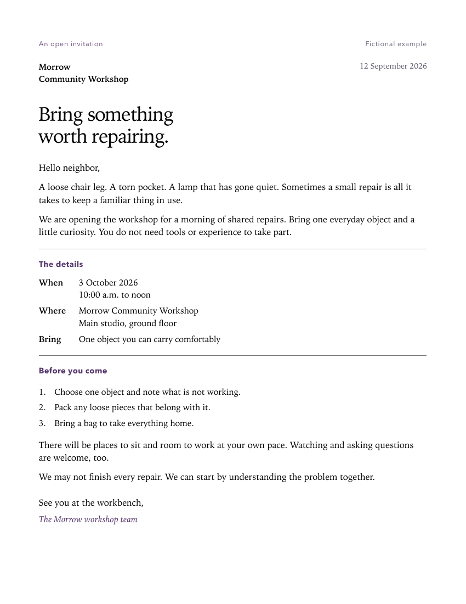

# HTML Letter Lab

A semantic HTML implementation of a supplied university letter, styled with the
course stylesheet and published with GitHub Pages. Built for INST630 Homework 1.

[View the live letter](https://kennethyeaher.github.io/KY_htmlLab/) ·
[Review verification results](docs/verification.md) ·
[Explore the companion source](companion/index.html)

## Contribution and scope

The course supplied the letter text and `tutorial_1_letter_styles.css`. The HTML
structure, class assignments, local image integration, repository, and deployment
were completed for this lab. The supplied visual design is credited to the course.

The project has no JavaScript, external fonts, package dependencies, or build step.
Its size and scope are intentional: practice readable HTML and demonstrate that
an implementation matches a supplied specification.

## Three decisions worth explaining

### Let the content determine the element

The research ideas are ranked, so they use an ordered list. Semester dates use
an unordered list. Dance names and definitions use `dl`, `dt`, and `dd`.
These distinctions remain available when styling is absent or content is read
with assistive technology.

```html
<ol class="priority-list">
  <li>...</li>
</ol>

<dl class="dance-definitions">
  <dt class="dance-term">Polynesian chicken dance</dt>
  <dd class="dance-definition">...</dd>
</dl>
```

These are abbreviated examples; the submission contains the full supplied text.

### Match the stylesheet through classes

```html
<p class="letter-paragraph letter-greeting">Dear Eileen,</p>
```

`letter-paragraph` supplies spacing, while `letter-greeting` supplies the greeting
size, weight, and color. The order of class names in HTML does not decide which
CSS rule wins. Cascade order and selector specificity resolve conflicting rules.

List item styles use descendant selectors such as `.priority-list li`. The class
belongs on the list; each item is matched through that ancestor.

### Make the submission portable

```html
<link rel="stylesheet" href="tutorial_1_letter_styles.css">

```

Both paths resolve beside the HTML. Explicit image dimensions reserve its space,
and alternative text conveys its subject. The document uses semantic dates,
abbreviations, subscripts, superscripts, quotation, and citation markup as well.

## Original companion: Correspondence

The [companion](companion/index.html) applies the same HTML skills to an original,
clearly fictional workshop invitation. It has its own stylesheet and leaves the
three graded files unchanged. Open `companion/index.html` locally to explore it.

A wide screen places the introduction beside a paper-like reading column. At
900 pixels and below, the content stacks. Native `details` elements expose design
notes, a skip link reaches the invitation, and a print stylesheet keeps the
complete letter on paper. No JavaScript or dependencies are required.

The [companion verification notes](docs/companion-verification.md) record mobile,
keyboard, HTML, contrast, and print checks, plus their limits.

<details>
<summary>View the actual Safari print preview</summary>



Saved with Safari at 100% on US Letter paper, with browser headers, footers, and
background printing off. This image shows the print layout; the screen layout
also includes the introduction and interactive design notes.

</details>

## Preview and submission

Open `index.html` in a browser or use VS Code Live Server. Submit these files
together, with no folder nesting between them:

| File | Purpose |
| --- | --- |
| `index.html` | Complete letter and stylesheet link; the Pages entry page. |
| `tutorial_1_letter_styles.css` | Supplied stylesheet, preserved unchanged. |
| `microscope.png` | Local image required by the HTML. |

The HTML was renamed from `tutorial_1.html` for Pages. The original starter files
remain outside this repository. Additional documentation is not needed to render
or grade the letter.

## Verification and remaining limits

The [verification report](docs/verification.md) records dates, methods, actual
results, and manual reproduction steps. The W3C HTML checker returned no messages.
Browser inspection confirmed applied styles, the image, keyboard focus, and no
page overflow at the tested widths of 320, 768, and 1280 CSS pixels.

The supplied yellow focus ring has low contrast. True 200% browser zoom and
VoiceOver listening tests remain unverified. The university dates and dance
research references have no supplied destinations and remain plain text. These
limits are documented without altering the assignment's supplied stylesheet or
inventing destinations.

| Rubric criterion | Evidence |
| --- | --- |
| Semantic HTML structure | Text preservation, HTML validation, and browser semantics checked. |
| Image inclusion | Local and live asset checks; browser reported the image loaded at 90 by 112 pixels. |
| CSS linking | Correct relative path; browser inspection confirmed the stylesheet and applied rules. |
| CSS classes | All 26 supplied class names applied and element mappings checked. |
| GitHub Pages | Deployment passed; live HTML and both assets matched local files. |

Pages is deployed from `main` and the repository root. Although the assignment
calls deployment optional, it assigns Pages four points out of twenty.

## Image credit

`microscope.png` is an unchanged copy of
[Microscope icon.png](https://commons.wikimedia.org/wiki/File:Microscope_icon.png)
from Wikimedia Commons. The page credits Musaromana for the original image and
MaxBet for removing its background, and lists it as public domain.

## What this exercise demonstrates

Working within an existing specification requires reading selectors, understanding
content, and checking the result in a browser. Visual output alone does not prove
valid HTML, and a valid document alone does not establish accessibility. Each
kind of evidence answers a different question.
